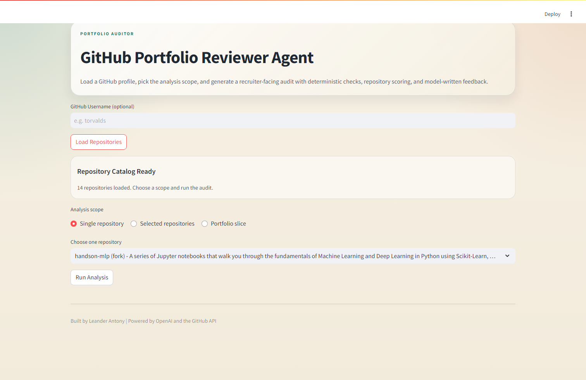
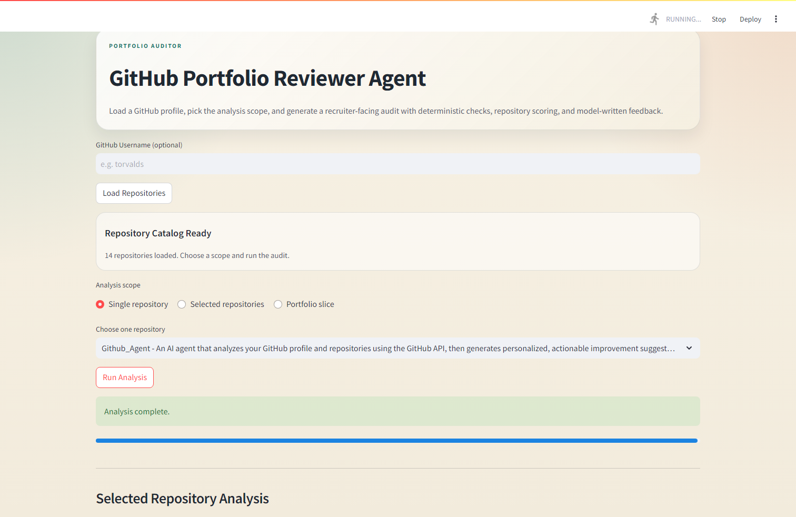

# GitHub Portfolio Reviewer Agent

GitHub Portfolio Reviewer Agent is a Streamlit app that audits a GitHub profile or a selected set of repositories and turns the result into a recruiter-facing report.

The app combines:

- GitHub API metadata and repository content checks
- deterministic scoring across documentation, discoverability, engineering, maintenance, and originality
- per-repository LLM analysis using `gpt-5-mini`
- portfolio-level synthesis and final polished report generation using `gpt-5.4`

It is designed for two use cases:

- `Portfolio audit`: review a whole GitHub profile or a selected group of repositories
- `Repository audit`: inspect a single project in detail without generating a portfolio summary

## UI Preview

### Repository Selection Flow



### Single Repository Audit View



## What It Does

For each selected repository, the app:

- fetches GitHub metadata, languages, README content, and root-level files
- runs deterministic checks for missing basics and engineering signals
- computes a transparent score with category breakdowns
- generates a repository summary, strengths, weaknesses, improvement actions, findings, and positive signals

For portfolio-level analysis, the app also:

- identifies the strongest repositories
- highlights portfolio-wide gaps
- suggests the highest-priority improvements
- produces a polished report that can be exported as `.md` or `.pdf`

## Current Features

- Load repositories from a public GitHub username or your own profile via token
- Choose analysis scope:
  - single repository
  - selected repositories
  - portfolio slice
- Skip forks for portfolio-slice mode
- Limit analysis to the most recently updated `N` repositories
- Cached GitHub fetches in the UI for faster repeated runs
- Repository scoring with visible category breakdowns
- Repo-by-repo audit panels in the UI
- Downloadable final report in Markdown or PDF

## Scoring Model

The current deterministic score is built from five categories:

- `Documentation`
  README quality, repository description, and demo/homepage signal
- `Discoverability`
  topics, license, and public metadata quality
- `Engineering`
  language detection, setup files, tests, and CI hints
- `Maintenance`
  update recency, branch/config presence, and whether the repo looks complete
- `Originality`
  fork status signal

These scores are intentionally transparent. They are meant to support the LLM analysis, not replace judgment.

## Architecture

```text
Github_Agent/
|- app.py
|- src/
|  |- config.py
|  |- schemas.py
|  |- github_client.py
|  |- repo_checks.py
|  |- prompts.py
|  |- openai_service.py
|  |- report_builder.py
|  `- exporters.py
`- tests/
   |- test_repo_checks.py
   `- test_report_builder.py
```

Module responsibilities:

- `app.py`
  Streamlit UI, cached loading, analysis-scope selection, progress states, and report rendering
- `src/github_client.py`
  GitHub API integration for repositories, README content, languages, and root-level entries
- `src/repo_checks.py`
  Deterministic checks and score generation
- `src/openai_service.py`
  OpenAI model calls for per-repo analysis, portfolio summary, and final polished report
- `src/report_builder.py`
  End-to-end orchestration of data collection, checks, LLM analysis, and report generation
- `src/exporters.py`
  Markdown and PDF export helpers

## Models Used

- `gpt-5-mini`
  per-repository analysis
- `gpt-5.4`
  portfolio summary
- `gpt-5.4`
  final polished report

## Setup

### 1. Create and activate a virtual environment

```powershell
python -m venv venv
venv\Scripts\activate
```

### 2. Install dependencies

```powershell
pip install -r requirements.txt
```

### 3. Add credentials

Create these files in the project root as needed:

- `openai_key.txt`
  required for all LLM analysis
- `github_token.txt`
  recommended for higher GitHub API limits and required to inspect your own repositories when no username is provided

The token and key files are ignored by Git.

## Running the App

```powershell
streamlit run app.py
```

Then:

1. Enter a GitHub username or leave it blank to analyze your own repositories with `github_token.txt`
2. Click `Load Repositories`
3. Choose one of:
   - `Single repository`
   - `Selected repositories`
   - `Portfolio slice`
4. Run the analysis
5. Review the scorecards and report
6. Export the report if needed

## Testing

Run the current test suite with:

```powershell
venv\Scripts\python.exe -m unittest tests.test_repo_checks tests.test_report_builder
```

## Example Analysis Flow

`Single repository`

- fetch one repository's README, language map, and root files
- run deterministic checks
- generate one repo audit
- produce a polished repository-only report

`Portfolio slice`

- fetch the selected or filtered repositories
- run repo checks and scoring for each repository
- generate one repo audit per repository
- synthesize a portfolio summary
- generate a polished final portfolio report

## Current Limitations

- The app does not yet support GitHub OAuth; it currently relies on a local token file for authenticated access
- Large portfolios can still take time because each repository gets its own model call
- The scoring model is rule-based and intentionally simple
- PDF formatting is improved, but the export layer can still be refined further

## Roadmap

- GitHub OAuth for real user authorization
- further PDF/report-template polish
- optional repository Q&A / RAG mode for deeper codebase exploration
- more robust automated tests around GitHub response parsing and failure modes

## Security Notes

- Never commit API keys or tokens
- Keep `openai_key.txt` and `github_token.txt` local only
- Use read-only GitHub token permissions for development unless broader access is truly needed

## Status

This repository is now beyond the initial MVP stage. The core audit pipeline, scoped analysis flow, scoring system, export flow, and polished Streamlit interface are implemented. The next major product milestone is making the app ready for external users through OAuth and deployment polish.
