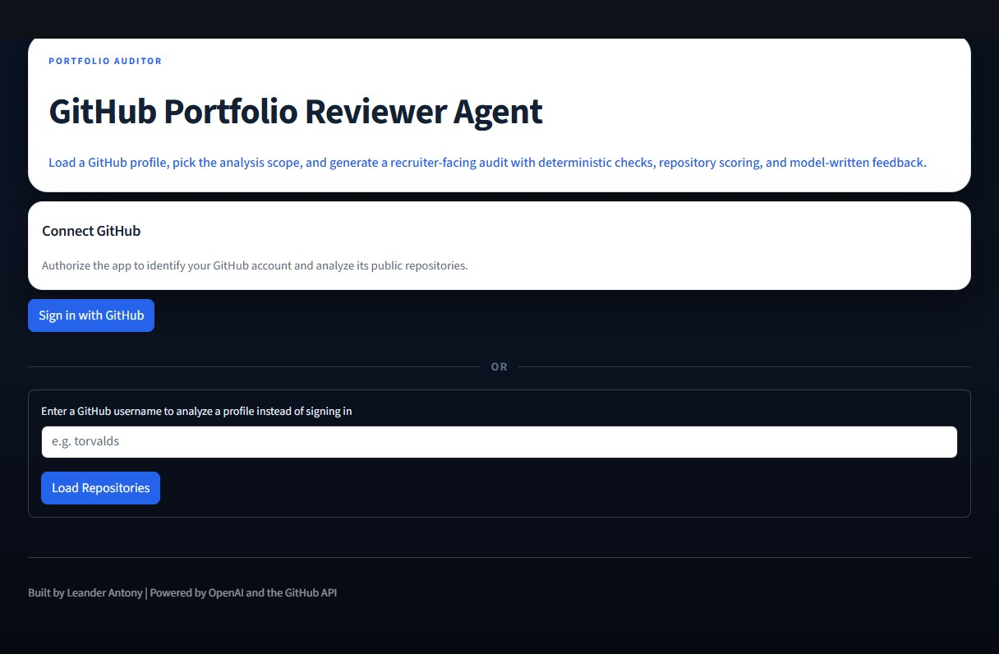
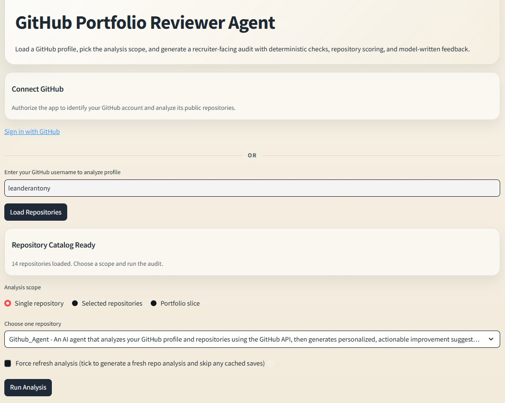
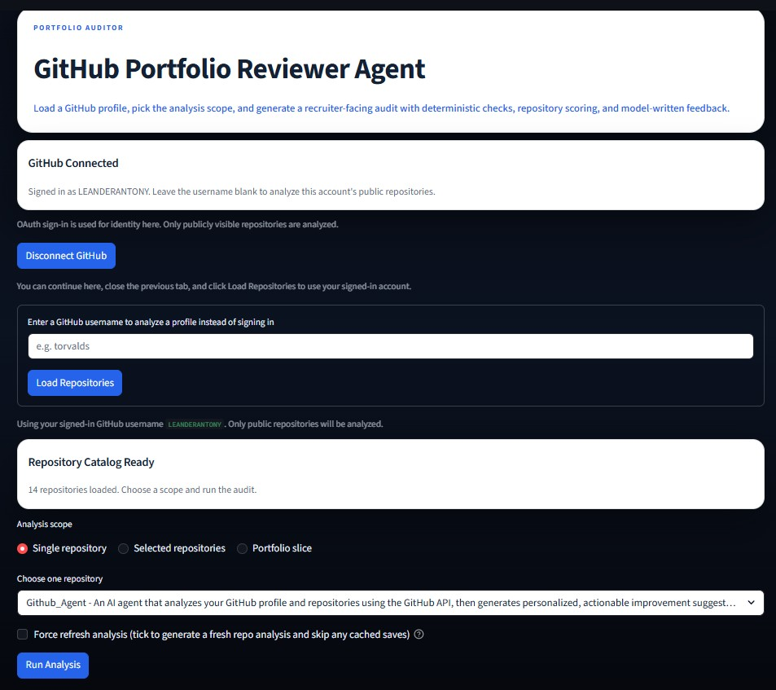
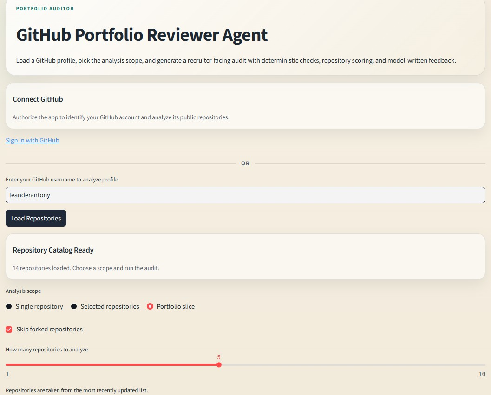
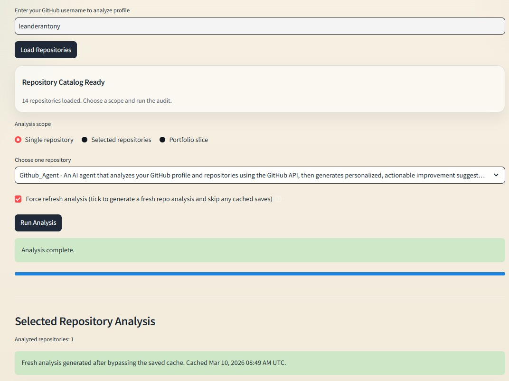
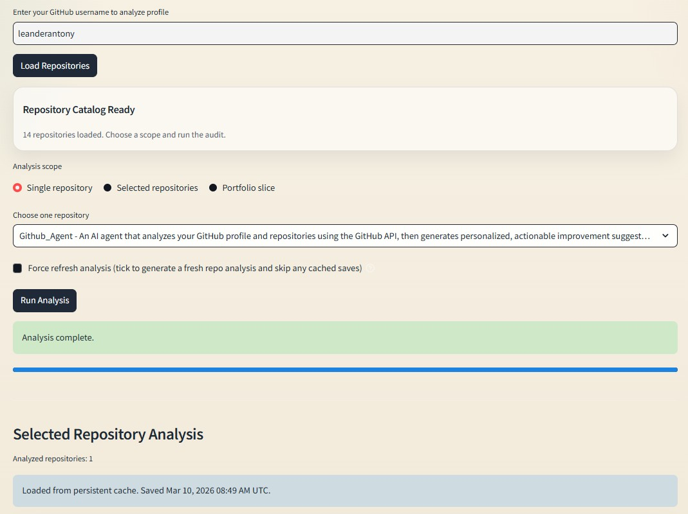
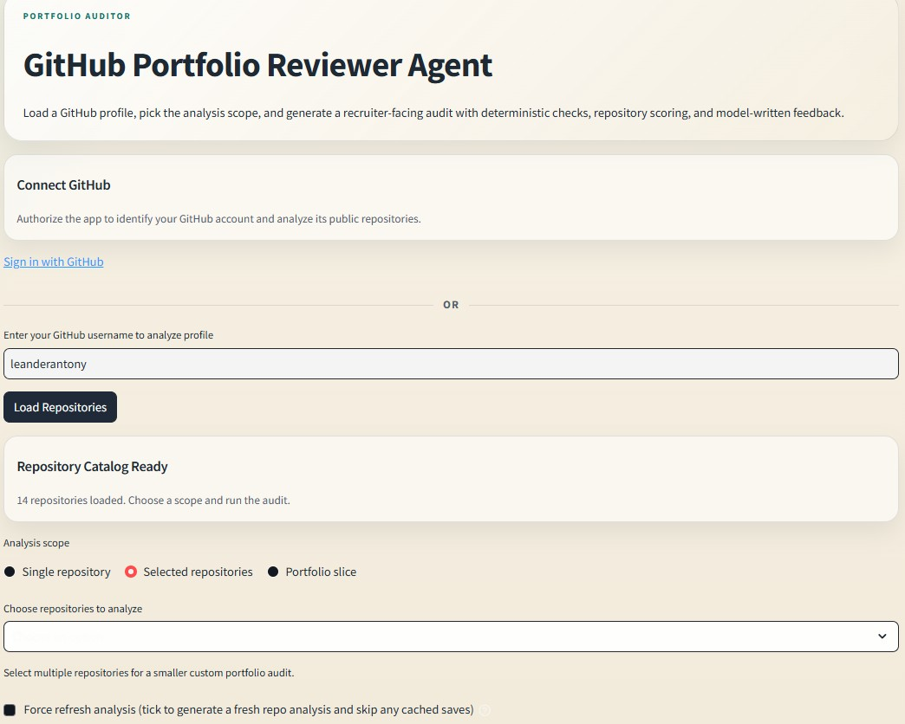
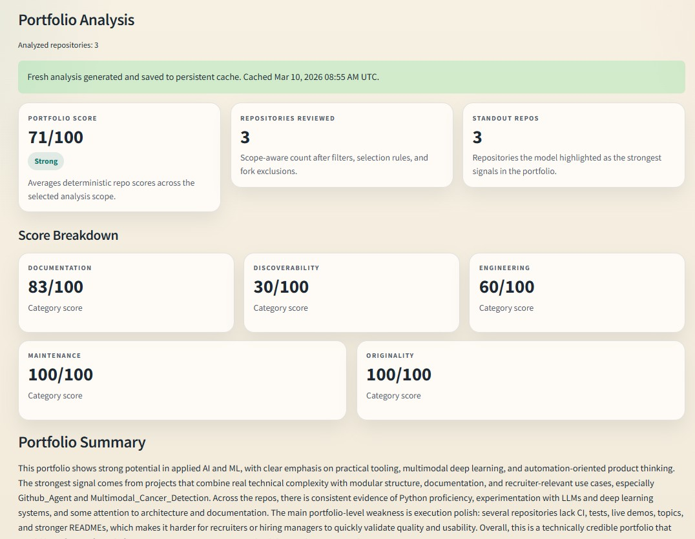
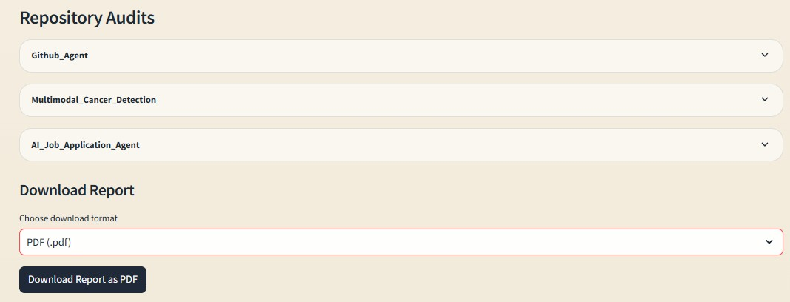

# GitHub Portfolio Reviewer Agent

GitHub Portfolio Reviewer Agent is a Streamlit app that audits a GitHub profile or a selected set of repositories and turns the result into a recruiter-facing report.

The app combines:

- GitHub API metadata and repository content checks
- deterministic scoring across documentation, discoverability, engineering, maintenance, and originality
- per-repository LLM analysis using `gpt-5-mini`
- portfolio-level synthesis using `gpt-5.4`

It is designed for two use cases:

- `Portfolio audit`: review a whole GitHub profile or a selected group of repositories
- `Repository audit`: inspect a single project in detail without generating a portfolio summary

## UI Preview

### Landing Page



### Username Repository Load



### OAuth Sign-In



Short OAuth sign-in demo: [docs/recordings/github_OAuth_login.mp4](docs/recordings/github_OAuth_login.mp4)

### Portfolio Slice Selection



### Single Repository Audit View



### Cached Analysis State



### Multi-Repository Analysis View



### Portfolio Summary View



### PDF Export Preview



## Sample Reports

- Single repository PDF sample: [docs/reports/singlerepo_analysis_report.pdf](docs/reports/singlerepo_analysis_report.pdf)
- Multi-repository PDF sample: [docs/reports/multirepo_analysis_with_portfoliosummary.pdf](docs/reports/multirepo_analysis_with_portfoliosummary.pdf)
- Multi-repository Markdown sample: [docs/reports/multirepo_md_report.md](docs/reports/multirepo_md_report.md)

## Demo Recordings

- GitHub OAuth login demo: [docs/recordings/github_OAuth_login.mp4](docs/recordings/github_OAuth_login.mp4)
- Single-repository analysis and report download demo: [docs/recordings/singlerepo_analysis&reportdownload_demo.mp4](docs/recordings/singlerepo_analysis&reportdownload_demo.mp4)
- Full workflow demo (Google Drive, view-only): [app_workflow.mp4](https://drive.google.com/file/d/1ltMC_iUdZvX8DdhEx0Mlu6x72-OygTNV/view?usp=drive_link)

## Decision Records

Architectural decisions are documented in [docs/adr/README.md](docs/adr/README.md).

## Architecture

A high-level system walkthrough is documented in [docs/architecture.md](docs/architecture.md).

## What It Does

For each selected repository, the app:

- fetches GitHub metadata, languages, README content, and root-level files
- runs deterministic checks for missing basics and engineering signals
- computes a transparent score with category breakdowns
- generates a repository summary, strengths, weaknesses, improvement actions, findings, and positive signals

For portfolio-level analysis, the app also:

- identifies the strongest repositories
- highlights portfolio-wide gaps
- suggests the highest-priority improvements
- produces a polished report that can be exported as `.md` or `.pdf`

## Current Features

- Load repositories from a public GitHub username or via GitHub OAuth sign-in for your own public profile
- Choose analysis scope:
  - single repository
  - selected repositories
  - portfolio slice
- Skip forks for portfolio-slice mode
- Limit analysis to the most recently updated `N` repositories
- Cached GitHub fetches in the UI for faster repeated runs
- Persistent SQLite-backed report caching with invalidation based on repository `updated_at` and default-branch commit SHA
- Visible cache status messaging in the UI plus a `Force refresh analysis` option to bypass saved results
- Repository scoring with visible category breakdowns
- Repo-by-repo audit panels in the UI
- Downloadable final report in Markdown or PDF
- HTML/CSS PDF rendering via Playwright with a ReportLab fallback path
- Graceful fallback and warning handling for GitHub, OAuth, OpenAI, and export failures
- Parallelized GitHub repo-detail fetching with retry handling for transient API failures

## Scoring Model

The current deterministic score is built from five categories:

- `Documentation`
  README quality, repository description, and demo/homepage signal
- `Discoverability`
  topics, license, and public metadata quality
- `Engineering`
  language detection, setup files, tests, and CI hints
- `Maintenance`
  update recency, branch/config presence, and whether the repo looks complete
- `Originality`
  fork status signal

These scores are intentionally transparent. They are meant to support the LLM analysis, not replace judgment.

## Architecture

```text
Github_Agent/
|- app.py
|- src/
|  |- analysis_store.py
|  |- config.py
|  |- errors.py
|  |- schemas.py
|  |- github_client.py
|  |- repo_checks.py
|  |- prompts.py
|  |- openai_service.py
|  |- report_builder.py
|  `- exporters.py
`- tests/
   |- test_analysis_store.py
   |- test_exporters.py
   |- test_github_auth.py
   |- test_github_client.py
   |- test_openai_service.py
   |- test_repo_checks.py
   `- test_report_builder.py
```

Module responsibilities:

- `app.py`
  Streamlit UI, cached loading, analysis-scope selection, progress states, and report rendering
- `src/github_client.py`
  GitHub API integration for repositories, README content, languages, and root-level entries
- `src/repo_checks.py`
  Deterministic checks and score generation
- `src/openai_service.py`
  OpenAI model calls for per-repo analysis and portfolio summary
- `src/report_builder.py`
  End-to-end orchestration of data collection, cache lookup, checks, LLM analysis, and report generation
- `src/analysis_store.py`
  Persistent SQLite-backed analysis cache and report serialization
- `src/errors.py`
  Shared typed application errors for GitHub, OAuth, OpenAI, and export failure handling
- `src/exporters.py`
  Markdown and PDF export helpers

## Models Used

- `gpt-5-mini`
  per-repository analysis
- `gpt-5.4`
  portfolio summary

## Setup

### 1. Create and activate a virtual environment

```powershell
python -m venv venv
venv\Scripts\activate
```

### 2. Install dependencies

```powershell
pip install -r requirements.txt
venv\Scripts\python.exe -m playwright install chromium
```

### 3. Add credentials

Create these files in the project root as needed:

- `openai_key.txt`
  required for all LLM analysis
- `github_oauth_client_id.txt`
  optional if you want browser-based GitHub sign-in in Streamlit
- `github_oauth_client_secret.txt`
  optional pair for GitHub OAuth app sign-in
- `github_oauth_redirect_uri.txt`
  optional OAuth callback URL, for example `http://localhost:8501`

Equivalent environment variables are also supported:

- `OPENAI_API_KEY`
- `GITHUB_OAUTH_CLIENT_ID`
- `GITHUB_OAUTH_CLIENT_SECRET`
- `GITHUB_OAUTH_REDIRECT_URI`
- `GITHUB_OAUTH_SCOPE`

A tracked reference file for environment-variable names is available at [`.env.example`](.env.example).

The token and key files are ignored by Git.

OAuth scope default:

- The app defaults to `read:user user:email`.
- If you want to override that, set `GITHUB_OAUTH_SCOPE`.
- In the current product flow, OAuth is used for identity and public-profile convenience only. The app analyzes public repositories only.

## Running the App

```powershell
streamlit run app.py
```

Then:

1. Enter a public GitHub username, or sign in with GitHub and leave the username blank to analyze your own public repositories
2. Click `Load Repositories`
3. Choose one of:
   - `Single repository`
   - `Selected repositories`
   - `Portfolio slice`
4. Run the analysis
5. Review the scorecards, report, and cache-status message
6. Export the report if needed

If you want to ignore a saved result and rerun everything, tick `Force refresh analysis`.

## Testing

Run the current test suite with:

```powershell
venv\Scripts\python.exe -m unittest tests.test_analysis_store tests.test_report_builder tests.test_exporters tests.test_repo_checks tests.test_github_auth tests.test_github_client tests.test_openai_service
```

## Example Analysis Flow

`Single repository`

- fetch one repository's README, language map, and root files
- fetch the default-branch head commit SHA for cache freshness validation
- run deterministic checks
- reuse a saved report when repo freshness metadata still matches
- show whether the result came from persistent cache or a fresh run
- otherwise generate one repo audit and produce a deterministic repository-only report

`Portfolio slice`

- fetch the selected or filtered repositories
- fetch freshness metadata for the selected repositories
- run repo checks and scoring for each repository
- generate one repo audit per repository
- synthesize a portfolio summary
- reuse a saved report when the cached repo fingerprint still matches
- otherwise generate a deterministic final portfolio report

## Current Limitations

- GitHub OAuth now requires you to configure your own GitHub OAuth app credentials and callback URL before browser-based sign-in will appear
- The app analyzes public repositories only; private repository access is intentionally not requested in the current OAuth flow
- Large portfolios can still take time because each repository gets its own model call even though GitHub metadata fetching is now parallelized and retried
- Persistent caching currently uses local SQLite storage, which is appropriate for local or single-instance hosting but not yet a shared distributed cache
- The scoring model is rule-based and intentionally simple
- PDF formatting is presentation-ready for normal reports, but the export layer can still be refined further for long portfolios and branded templates
- The higher-quality PDF path depends on Playwright/Chromium being available in the runtime environment

## Roadmap

- deployment setup for public usage
- hosted persistence/secrets strategy for multi-instance deployment
- optional repository Q&A / RAG mode for deeper codebase exploration
- deeper export branding and report theming

## Security Notes

- Never commit API keys or tokens
- Keep `openai_key.txt` and OAuth credential files local only
- If you later add private-repo support, prefer a GitHub App or fine-grained personal access token with minimal permissions

## Status

This repository is now beyond the initial MVP stage. The core audit pipeline, scoped analysis flow, persistent analysis caching, deterministic report generation, export flow, polished Streamlit interface, public-only GitHub OAuth sign-in, cache-aware UX, retry-aware GitHub fetching, and broader failure-path coverage are implemented. The next major product milestone is deployment hardening.
