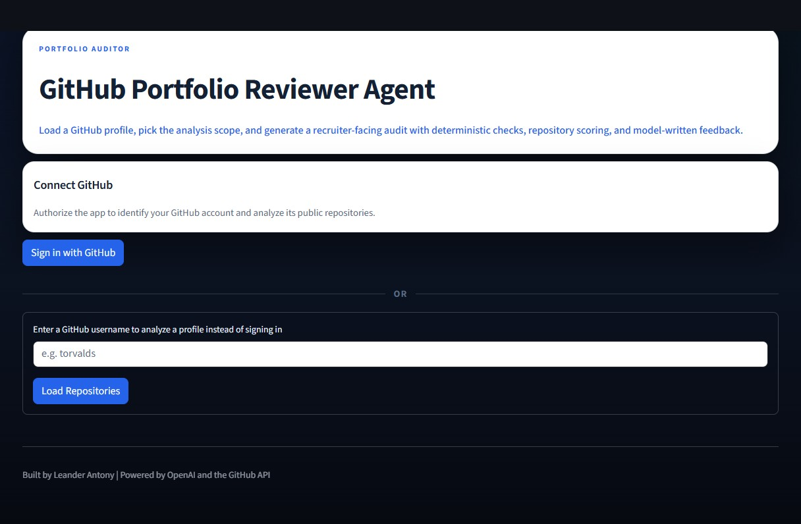
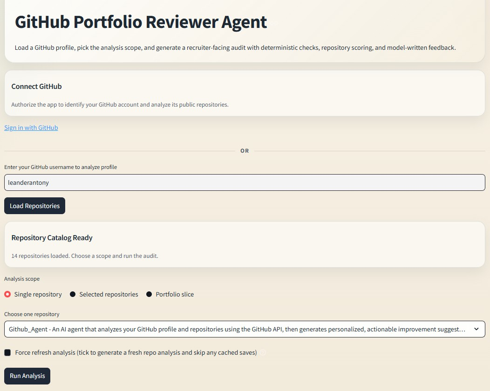
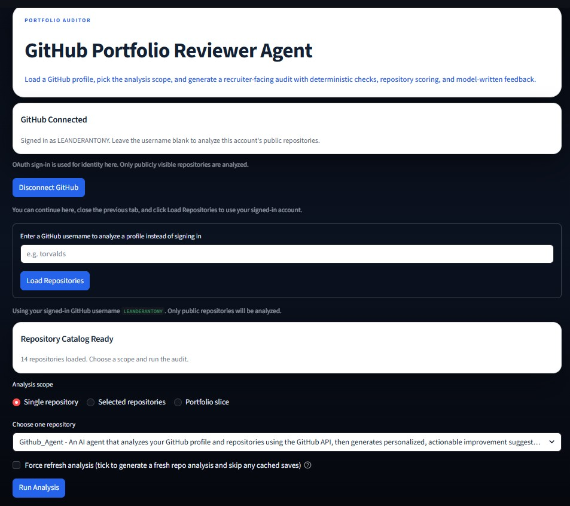
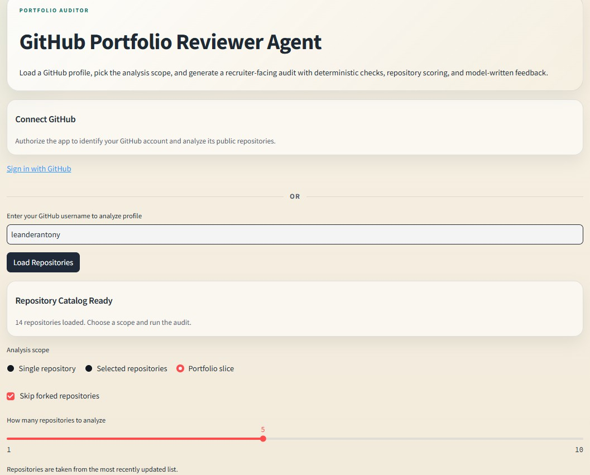
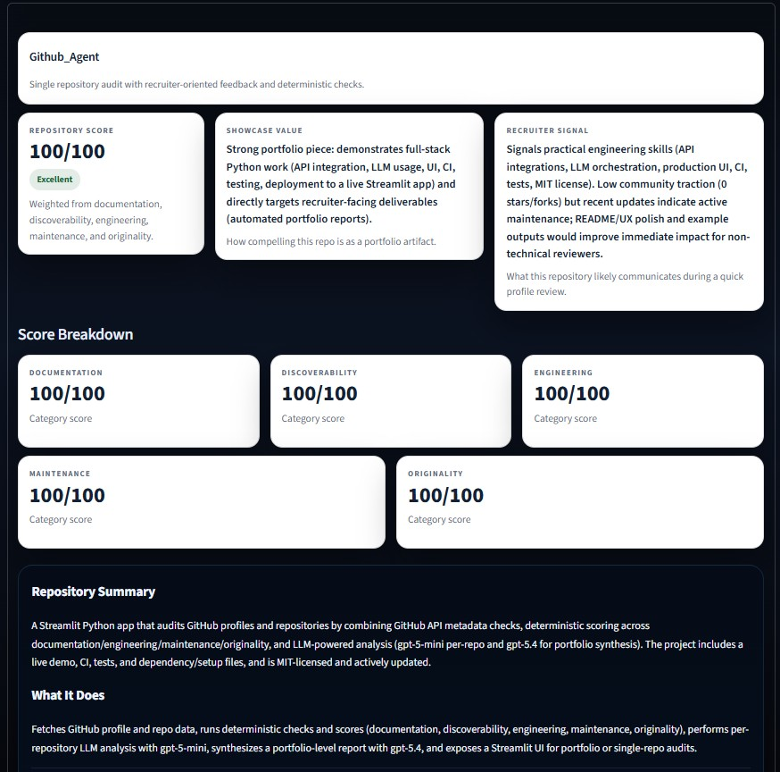
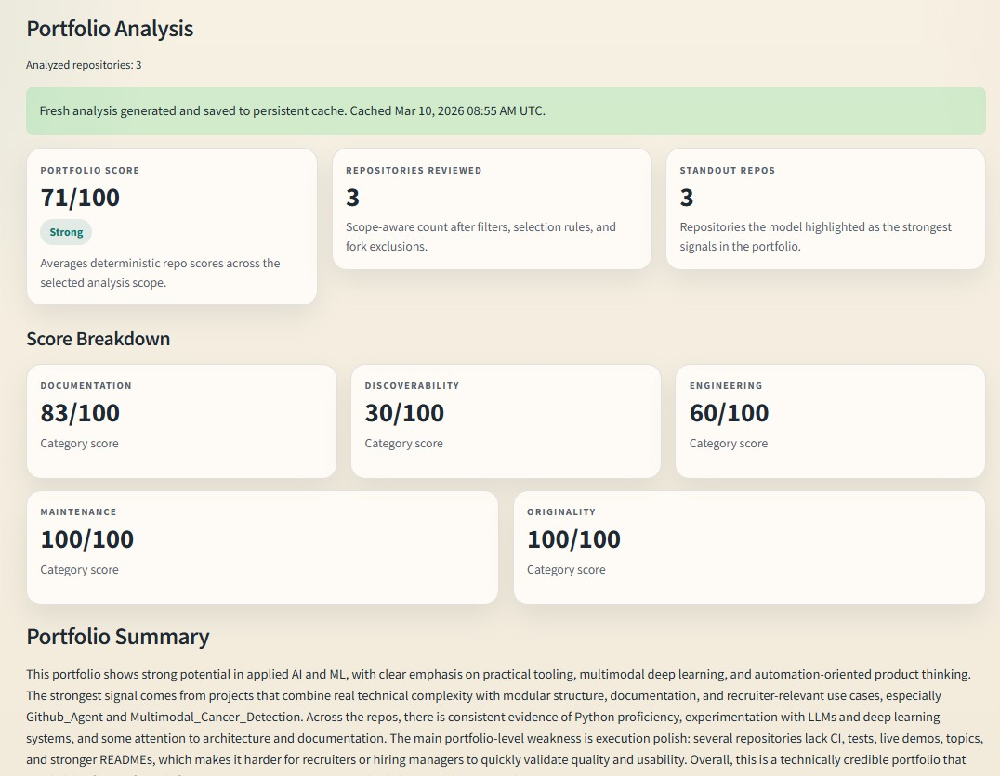
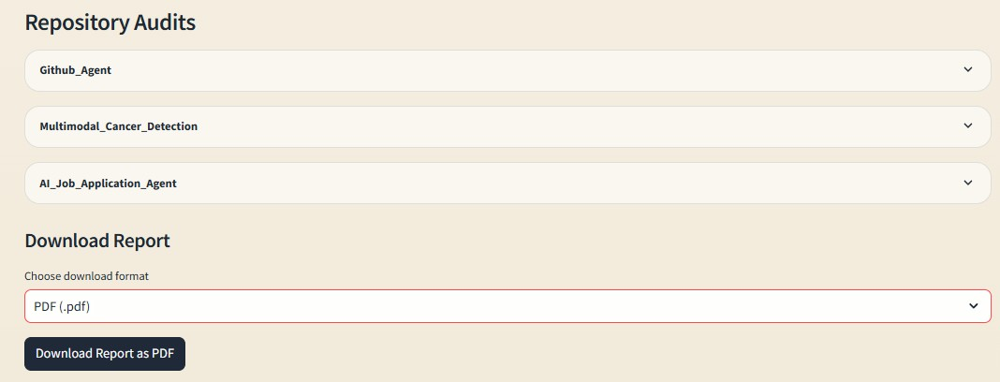

# GitHub Portfolio Reviewer Agent

GitHub Portfolio Reviewer Agent is a Streamlit app that audits GitHub repositories and profiles, scores portfolio quality, and generates recruiter-facing improvement reports.

Live app: [portfolio-reviewer-agent.streamlit.app](https://portfolio-reviewer-agent.streamlit.app)

The app combines:

- GitHub API metadata and repository content checks
- deterministic scoring across documentation, discoverability, engineering, maintenance, and originality
- per-repository LLM analysis using `gpt-5-mini`
- portfolio-level synthesis using `gpt-5.4`

It is designed for two use cases:

- `Portfolio audit`: review a whole GitHub profile or a selected group of repositories
- `Repository audit`: inspect a single project in detail without generating a portfolio summary

## UI Preview

### Landing Page

### Username Repository Load

### OAuth Sign-In

Short OAuth sign-in demo: [docs/recordings/oauth_login_demo.mp4](docs/recordings/oauth_login_demo.mp4)

### Portfolio Slice Selection

### Single Repository Audit View

### Portfolio Summary View

### PDF Export Preview

## Sample Reports

- Single repository PDF sample: [docs/reports/singlerepo_analysis_report.pdf](docs/reports/singlerepo_analysis_report.pdf)
- Multi-repository PDF sample: [docs/reports/multirepo_analysis_with_portfoliosummary.pdf](docs/reports/multirepo_analysis_with_portfoliosummary.pdf)
- Multi-repository Markdown sample: [docs/reports/multirepo_md_report.md](docs/reports/multirepo_md_report.md)

## Demo Recordings

- GitHub OAuth login demo: [docs/recordings/oauth_login_demo.mp4](docs/recordings/oauth_login_demo.mp4)
- Repository analysis demo: [docs/recordings/repo_analysis_demo.mp4](docs/recordings/repo_analysis_demo.mp4)
- Full workflow demo (Google Drive, view-only): [full_app_workflow.mp4](https://drive.google.com/file/d/1ltMC_iUdZvX8DdhEx0Mlu6x72-OygTNV/view?usp=drive_link)

## Decision Records

Architectural decisions are documented in [docs/adr/README.md](docs/adr/README.md).

## Roadmap Document

The longer-term product vision is outlined in [ROADMAP.md](ROADMAP.md).

## Architecture

A high-level system walkthrough is documented in [docs/architecture.md](docs/architecture.md).

## What It Does

For each selected repository, the app:

- fetches GitHub metadata, languages, README content, and root-level files
- runs deterministic checks for missing basics and engineering signals
- computes a transparent score with category breakdowns
- generates a repository summary, strengths, weaknesses, improvement actions, findings, and positive signals

For portfolio-level analysis, the app also:

- identifies the strongest repositories
- highlights portfolio-wide gaps
- suggests the highest-priority improvements
- produces a polished report that can be exported as `.md` or `.pdf`

## Scoring Model

The current deterministic score is built from five categories:

- `Documentation`
  README quality, repository description, and demo/homepage signal
- `Discoverability`
  topics, license, and public metadata quality
- `Engineering`
  language detection, setup files, tests, and CI hints
- `Maintenance`
  update recency, branch/config presence, and whether the repo looks complete
- `Originality`
  fork status signal

These scores are intentionally transparent. They are meant to support the LLM analysis, not replace judgment.

## Models Used

- `gpt-5-mini`
  per-repository analysis
- `gpt-5.4`
  portfolio summary

## Example Analysis Flow

`Single repository`

- fetch one repository's README, language map, and root files
- fetch the default-branch head commit SHA for cache freshness validation
- run deterministic checks
- reuse a saved report when repo freshness metadata still matches
- show whether the result came from persistent cache or a fresh run
- otherwise generate one repo audit and produce a deterministic repository-only report

`Portfolio slice`

- fetch the selected or filtered repositories
- fetch freshness metadata for the selected repositories
- run repo checks and scoring for each repository
- generate one repo audit per repository
- synthesize a portfolio summary
- reuse a saved report when the cached repo fingerprint still matches
- otherwise generate a deterministic final portfolio report

## Current Limitations

- GitHub OAuth now requires you to configure your own GitHub OAuth app credentials and callback URL before browser-based sign-in will appear
- The app analyzes public repositories only; private repository access is intentionally not requested in the current OAuth flow
- Large portfolios can still take time because each repository gets its own model call even though GitHub metadata fetching is now parallelized and retried
- Persistent caching currently uses local SQLite storage, which is appropriate for local or single-instance hosting but not yet a shared distributed cache
- The scoring model is rule-based and intentionally simple
- PDF formatting is presentation-ready for normal reports, but the export layer can still be refined further for long portfolios and branded templates
- The higher-quality PDF path depends on Playwright/Chromium being available in the runtime environment

## Status

This repository is now beyond the initial MVP stage. The core audit pipeline, scoped analysis flow, persistent analysis caching, deterministic report generation, export flow, polished Streamlit interface, public-only GitHub OAuth sign-in, cache-aware UX, retry-aware GitHub fetching, broader failure-path coverage, hosted Streamlit deployment, and baseline GitHub Actions CI are implemented. The next major product milestone is GitHub-side polish and longer-term hosting hardening.
